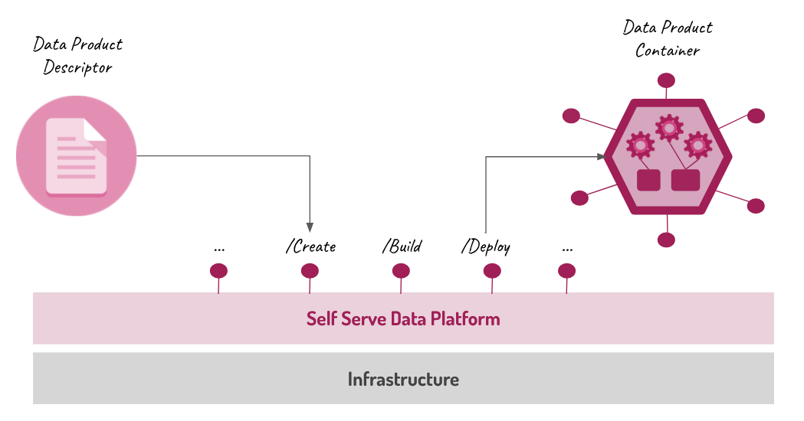

# Overview

The goal of the Open Data Mesh initiative is to create a platform that allows managing the entire lifecycle of data products, starting from atomic deployment and reaching up to decommissioning, through a series of services implemented both at the data product experience plane and at the infrastructure utility plane level.

